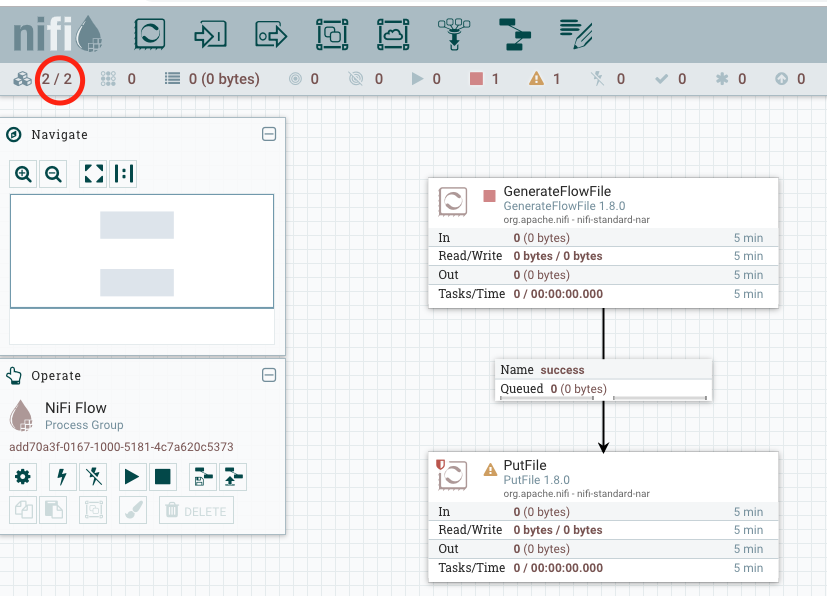

# Simple NIFI Cluster

A simple NIFI cluster on ECS. See example running in docker-compose in example

## Startup 

```bash
$ docker-compose up -d
$ docker-compose logs -f # to view logs and watch cluster form
```
Login: [http://localhost:8080](http://localhost:8080)

Can create a simple flow using this [tutorial](https://medium.com/@suci/hello-world-nifi-dcafcba0fdb0)

## Tear down

To stop the containers and clear up images

```bash
$ docker-compose down
```

### Note:

* data-0 and data-1 directories are mounted into the container to persist state between runs
* containers can be completely destroyed and restarted and will leave work in place if directories are in place


Tutorial should look yield something like:

